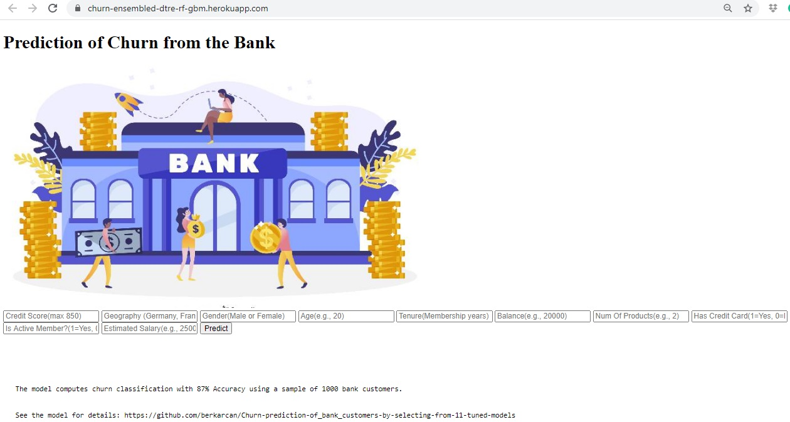

# Heroku-Churn-Ensembled-Model
* Online deployment of Churn-prediction-of_bank_customers-by-selecting-from-11-tuned-models project
https://github.com/berkarcan/Churn-prediction-of_bank_customers-by-selecting-from-11-tuned-models
* This model was run on Kaggle in a simplified version without visualisations. See the modeal at https://www.kaggle.com/berkanacar/tune-11-models-ensemble-predict-churn-and-deploy
* The model selected Decisiontree, Random Forest and GBM algorithms as the best predicting three algoritms, ensembling those three provided a better accuracy (87%). This ensembled model is used in deploying the model online.

* The model can be run in the following website:
https://churn-ensembled-dtre-rf-gbm.herokuapp.com

The screetshot of the online deployment is:

